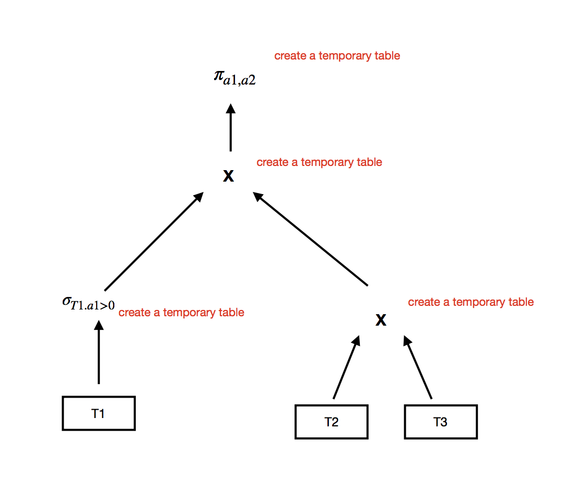
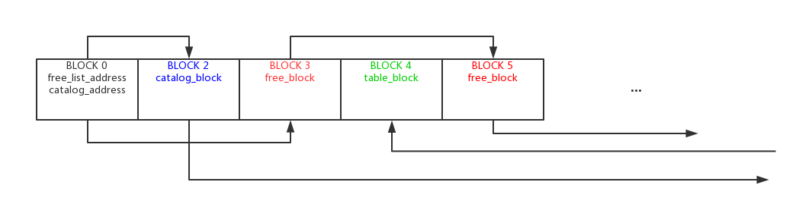
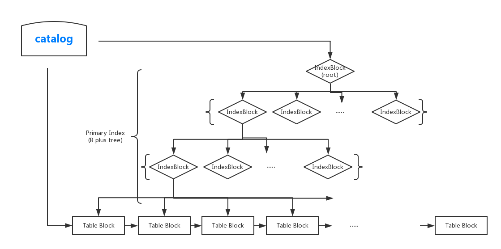

# MiniSQL

- an update verison of repo [ADS-DBAwesomeGroup/MiniSQL](https://github.com/ADS-DBAwesomeGroup/MiniSQL)  
    + alter ***Interpreter***(originally written in csharp) to make it platform independent
    + rewrite ***IndexManager***
    + add an abstract level ***RecordManager***
    + rewrite ***API*** to make use of ***RecordManager***
- **highlight**
    + well separated interpreter and underlying layer
    + LR(1) interpreter totally built by hand
    + high extensiblity of table index methods
    + high extensiblity of join methods
- **weakness**
    + too many pointers :) 

## Query Overview

- get a query sql sentence and think about its relational algebra
- execute query strictly follow relational algebra. 
- in doing relational algebra, create a temperary table in every step

**e.g.**
``` sql
SELECT a1, a2 FROM  T1 join (select * from T2, T3) where t1.a1 > 0;
```



## Storage On Disk
- MiniSQL store a database (includes table data and meta data) on disk in a single file: \*.db



- Records in database are all sorted in the table by some attributes (primary key if exists, otherwise choose one from all the attributes). And every table has a primary index implemented in B plus tree.



## Module Description

### Interpreter
    totally build by hand,
- **Naive Lexer**
    + define token
    + build regex pattern for every token type
    + iterate every pattern to find the longest match
- **LR(1) Parser**
    + [grammar](https://github.com/Jason0214/MiniSQL/blob/master/doc/SQL%20Parser%20DFA.md)
    + [state graph of parsing sql](https://github.com/Jason0214/MiniSQL/blob/master/doc/SQL%20Parser%20DFA.pdf)
    + states are all taged by enum, so very readable
    + bad: too many function call, lose performance
- **Executor**
    + parse the AS tree
    + make use of ***API*** module to communicate with underlying layer

### API
- separate ***Interpreter*** and low level modules
- implementation of API call

### IndexManager
    IndexManager contains implementations of primary and second index
- **Extensiblity**
    + provide universal interface in ***IndexEntry.h***
- **Index Methods**
    - [x] B plus tree index
    - [ ] hash index

### RecordManager
    RecordManager has two jobs, one is managing all the tables used in the query, the other one is providing multiple join method
- **Relavent Data Structures**
    + ***Table***
        * ***Table*** class is an encapsulation of ***materialized table*** or ***temporary table*** and expose same interfaces to upper level module regardless which type of table it is
        * hide the detail of handling either ***materialized table*** and ***temporary table***  
    + ***materialized table*** 
        + tables in the database
        + stored on disk
        + considered as a collection of blocks
    + ***temporary table*** 
        + tables created through the execution of a query
        + stored in memory
        + do not have idea of block
- **Table Management**
    + in the begin of every query execution, initialize an empty map
    + if a temporary table created, insert (key=table_name, value = class table) into map
    + other module may request for a table from ***RecordManager***, if requested table is not in the map, ***RecordManager*** will check it in ***Catalog*** to see whether it is a materialized table, if still not found, throw an error.
- **Materialize Temporary Table**
    + it happens that a temporary table goes too large to fit in memory
    + then it would be materialized by ***RecordManager***, that is write it to disk
    + since upper level module only manipulate data in class ***table***, so materialize a temporary table would not involve anything in upper level 
- ***Join***
    + for different table, join operation should be done differently. For example, for two materialized tables, Block-Wise join is recommanded, while for two temporary tables, we should do Tuple-Wise join
    + different join functions are provided by ***RecordManager***

### CatalogManager
    store and manage all the meta data in database such table name, attribute name, attribute number, attribute type and so on
- catalog manager in this project is **shit**
- I use B plus tree to index the meta, expect to have a higher performance, however, it makes the code very messy, *only god knows what I was doing then*.

### BufferManager
    the only module communicate with the disk, all the other module request a block of data from BufferMananger. 
    Since the disk has high access time, BufferManager also cached some blocks in the memory.
- **Block Buffer**
    + BufferManager cache blocks in a hash table
    + offset in the \*.db file of a block is the key to hash
    + hash table is open address to solve hash collision
- **LRU**
    + when need to read a block into memory while the buffer is full, LRU algorithm is used to swap a block out.
    + LRU is implemented in a double linked list, every node points to a block in the buffer. 
    + after an access to a block, linked list node points to that block is moved to the head of double linked list